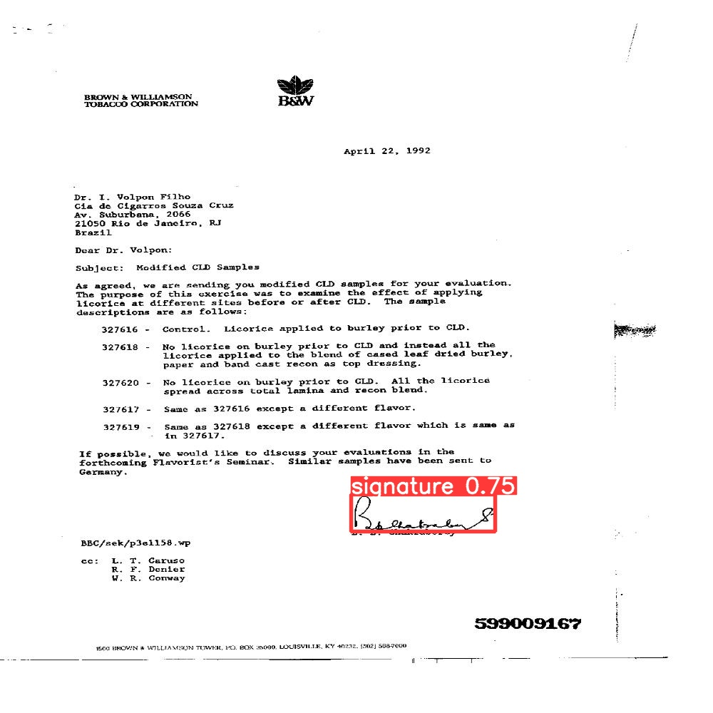
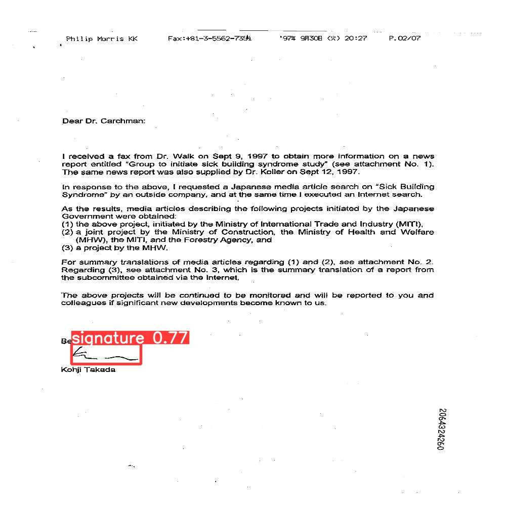
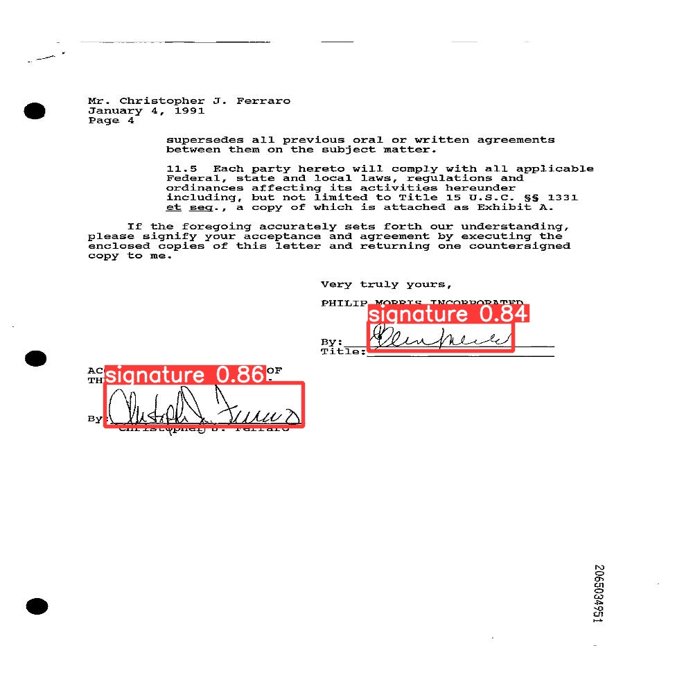
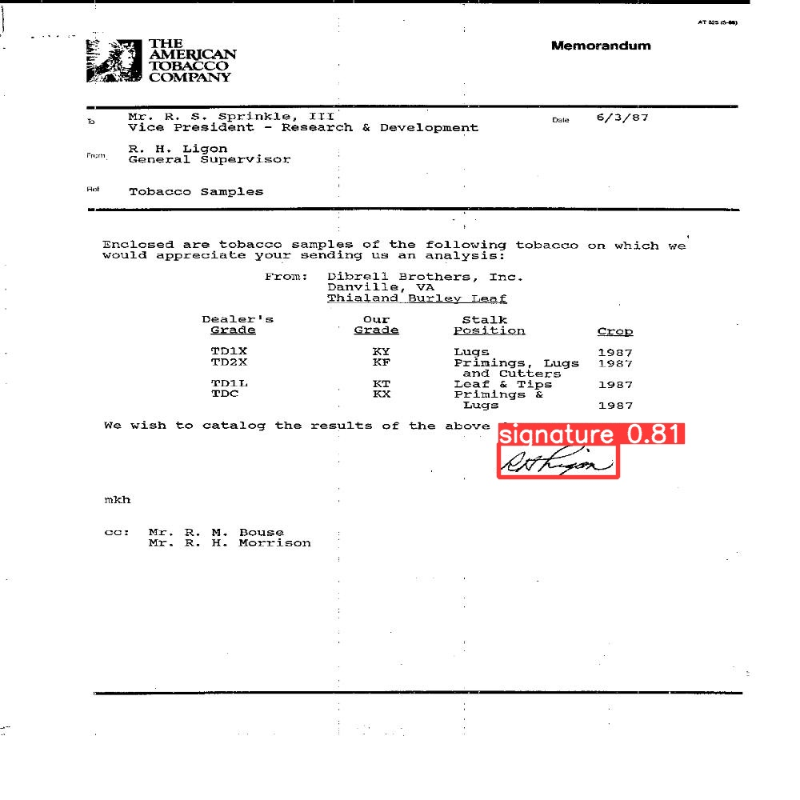
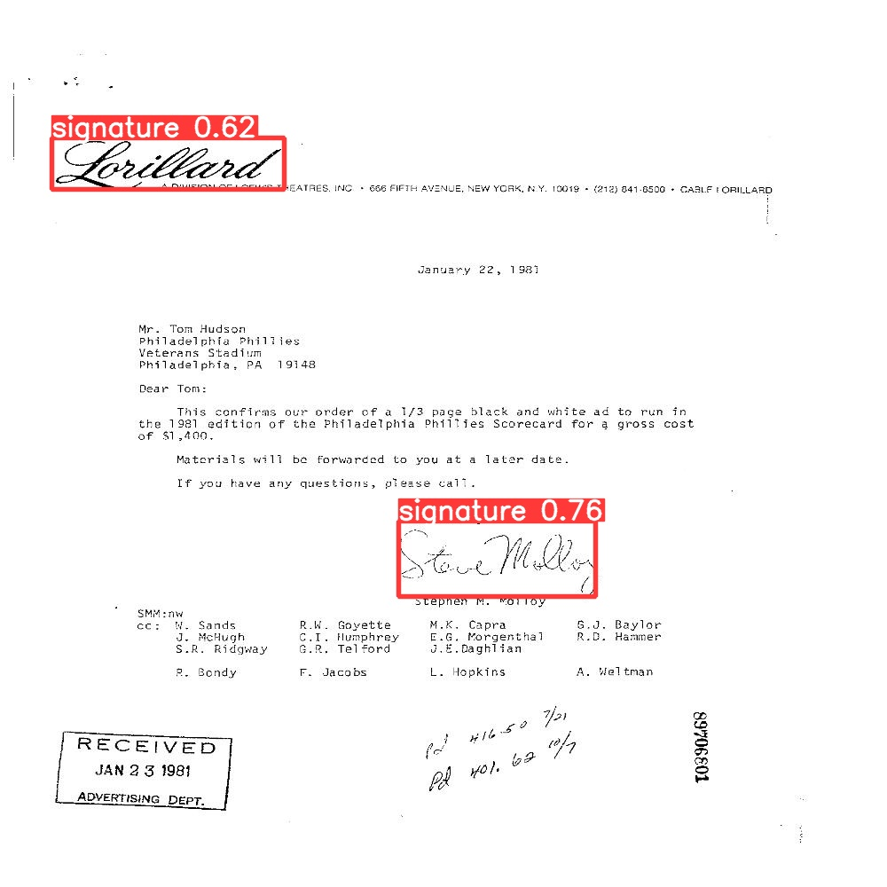

# Signature-object-detection

## Aiming
Identifying to whom a handwritten signature belongs to and whether it is real or forged through a multistage pipeline.

## Objectives
- Apply Image preprocessing or Feature Extraction techniqueswhere needed  
- Train a classification model to determine to whom a handwritten signature belongs to. You canuse classical computer vision or regular deep learning for this stage  
- Train another model(s) to determine whether the signature is real or forged. In this stage you can either train a single Siamese model or multiple classical/regular deep learning models (A model for each person to determine whether a signature is real or forged).  
- Signature object detection in document. Apply one object detection model (Faster RCNN or YOLO and so on) on the new detection dataset.  

## Dataset
This dataset provided contains of 5 subfolders and each subfolder of these 5 contains train and test folders for part one (classification)

You can find the dataset here: https://drive.google.com/file/d/1WqIhqp9JJ65SZPs9v868P_-SBCVTR2By/view?usp=sharing

This dataset consists of four folders:  
‘TrainImages’ folder : contains the training images (660 images) for the detection task  
- ‘TrainGroundTruth’ folder: contains the corresponding detection labels (660 files) for training detection task  
• Each image in ‘TrainImages’ folder has a corresponding text file in this folder with the same name as the image  
• The text file has (1 or more) rows. Each row represents the bounding box of a single signature.  
• Each row has 4 values: x1,y1,x2,y2  
- ‘TestImages’ folder : contains the training images (115 images) for the detection task  
- ‘TestGroundTruth’ folder: contains the corresponding detection  
labels (115 files) for testing the detection task  

You can find the dataset here: https://drive.google.com/file/d/1gew1zSfSZKiUKGPGc3bpGXbO03HvE9-_/view?usp=sharing

## Achievement
You can find all details and achievements for this project here: https://drive.google.com/file/d/17KZNCBJwrqVc5e0hq_SC_i2mwK5HfiHS/view?usp=sharing 

## Language 
Python

## Images

